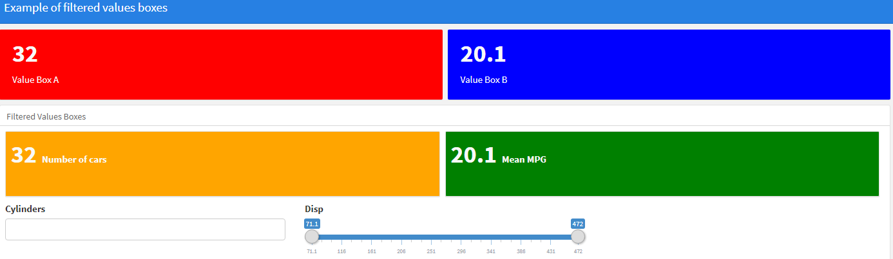

# Values boxes round summary widget

<!-- badges: start -->
<!-- badges: end -->

This repo show how you can embed summary widgets in values bowes by recreating the HTML tags around it as below :

The example is provided in `flex_value_box.Rmd`.

Feel free to get in touch if you have questions.
